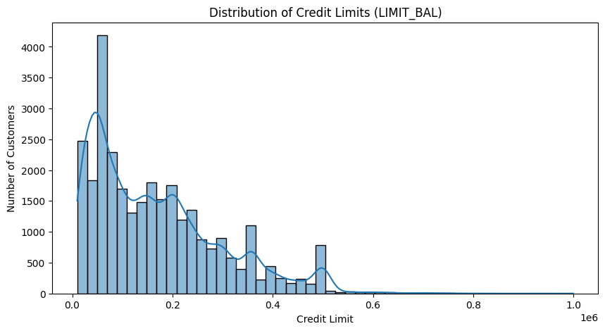
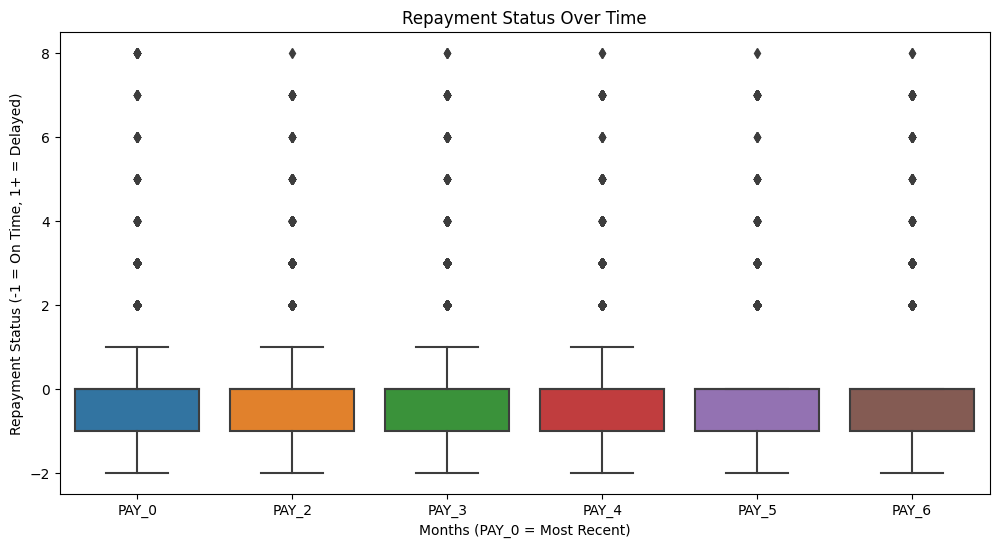
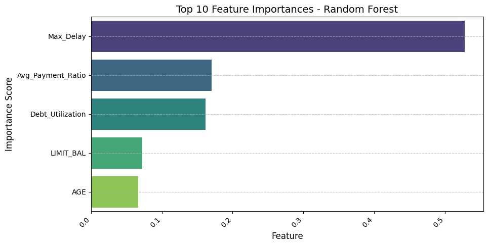
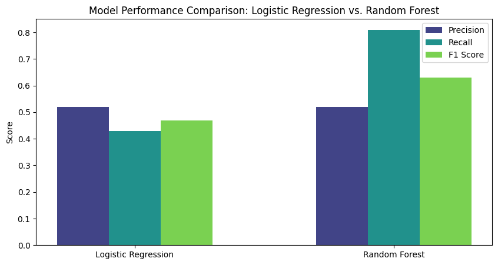

# Loan Default Risk Analysis

## 📌 Project Overview

Loan default is a significant issue in the finance industry, costing billions annually.
This project aims to build a **predictive model** that identifies high-risk borrowers and recommends **data-driven strategies** to minimize loan defaults.

## Business Objectives

- Identify key factors influencing loan defaults.
- Predict default risk using machine learning models.
- Recommend approval strategies for financial institutions.

## Tech Stack

- **Python** (Pandas, Scikit-learn, Matplotlib, Seaborn)
- **SQL** (for data extraction and querying)
- **Power BI/Tableau** (for interactive dashboards)
- **Jupyter Notebook** (for EDA and modeling)
- **GitHub Actions** (for workflow automation)

## 📂 Project Structure

- `data/` – Source data files (cleaned datasets are stored here)
- `notebooks/` – Jupyter notebooks for EDA and ML models
- `reports/` – Business insights and final recommendations
- `src/` – Python scripts for data processing and model training
- `dashboards/` – Power BI or Tableau dashboards

## EDA - Exploratory Data Analysis

### Distribution of Credit Limits

- Most customers have credit limits **below $200,000**, with a **right-skewed distribution**.
- Higher credit limits may indicate **lower risk**, while low credit customers may have **higher default rates**.
  

### Repayment Status Over Time

- Customers with **delayed payments in earlier months** tend to continue **defaulting**.
- Many **outliers (dots)** represent **chronic late payers**, indicating **high-risk borrowers**.
- Financial institutions should **intervene early** when a customer **misses a payment**.
  

## Feature Importance Analysis

Using **Random Forest Feature Importance**, we identified the most critical factors affecting loan default.

**Top Predictive Features:**

1. **Recent Payment Delays (`PAY_0`, `PAY_2`)** – The most influential factors.
2. **Credit Limit (`LIMIT_BAL`)** – Higher limits are associated with lower default risk.
3. **Bill Statement Amounts (`BILL_AMT1-6`)** – Outstanding debts significantly impact risk.
4. **Past Payment Amounts (`PAY_AMT1-6`)** – Indicates a borrower’s financial responsibility.

**Feature Importance Visualization:**

## Model Performance & Comparisons

Trained and evaluated multiple models, including **Logistic Regression and Random Forest**. Below are their performance metrics:

### **Logistic Regression Results with SMOTE**

| Metric    | Score |
| --------- | ----- |
| Precision | 0.93  |
| Recall    | 0.95  |
| F1-Score  | 0.94  |
| Accuracy  | 0.89  |

- **Logistic Regression performed well** but struggled with recall for high-risk borrowers.
- **Best Parameters:** `{'C': 0.001, 'solver': 'lbfgs'}`

### **Random Forest with SMOTE**

| Metric    | Score |
| --------- | ----- |
| Precision | 0.97  |
| Recall    | 0.91  |
| F1-Score  | 0.94  |
| Accuracy  | 0.90  |

**Model Performance Visualization:**

- **SMOTE (Synthetic Minority Over-sampling Technique) improved recall** for high-risk borrowers.
- Random Forest achieved a better balance of **precision and recall** compared to Logistic Regression.

## 🔍 Key Insights

- **SMOTE improved the model's ability to detect high-risk borrowers** by increasing recall.
- **Random Forest performed better overall**, making it the preferred model for this use case.
- **Future Work:** Fine-tuning hyperparameters and exploring additional models like XGBoost.

## 📢 Business Recommendations

1. **Early Intervention:**  
   Customers with **early payment delays (PAY_0, PAY_2)** should be flagged for **risk monitoring**.
2. **Credit Limit Adjustments:**  
   Borrowers with **low credit limits** and **high repayment issues** should undergo **stricter approval checks**.

3. **Payment Behavior Monitoring:**  
   Implement a **real-time alert system** for customers showing **consistent delayed payments**.

4. **Automated Risk-Based Interest Rates:**  
   Adjust loan interest rates dynamically based on **default probability scores**.

## 👥 Contributors

- **Philip Timothe** – Business/Data Analyst and Engineer & Project Lead
